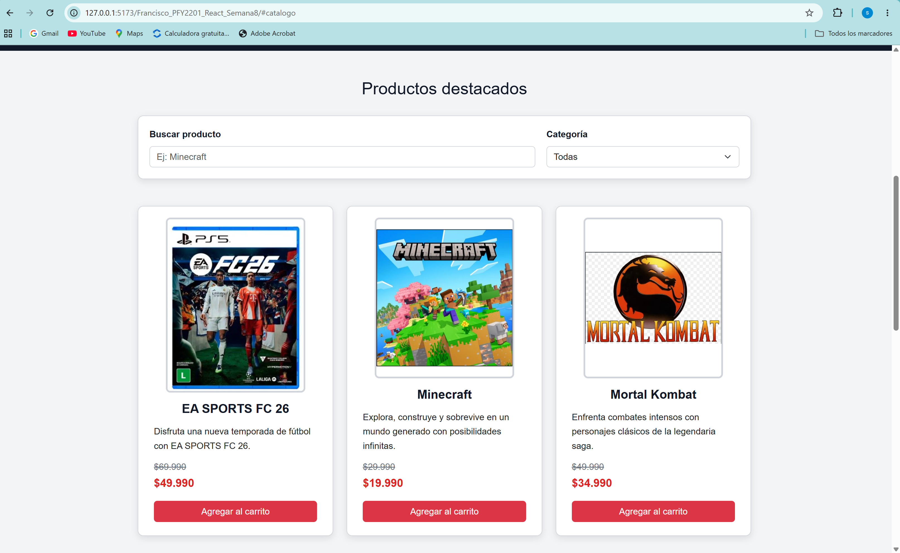
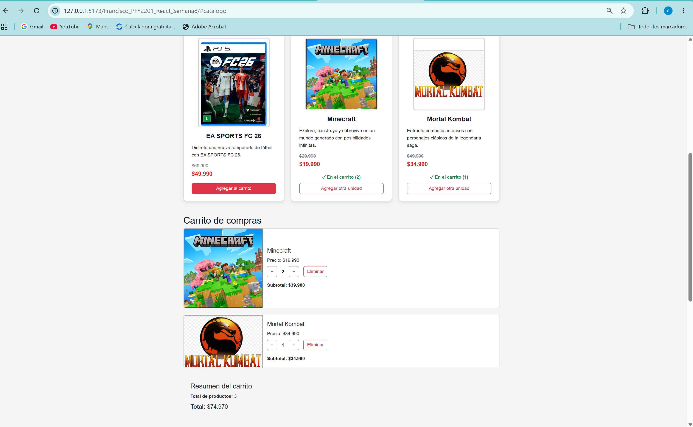
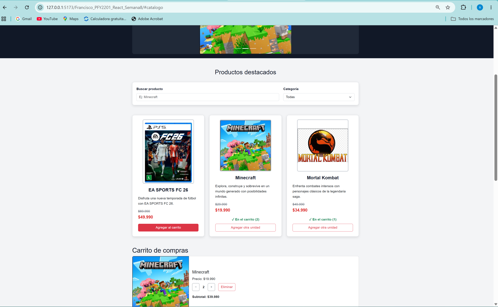
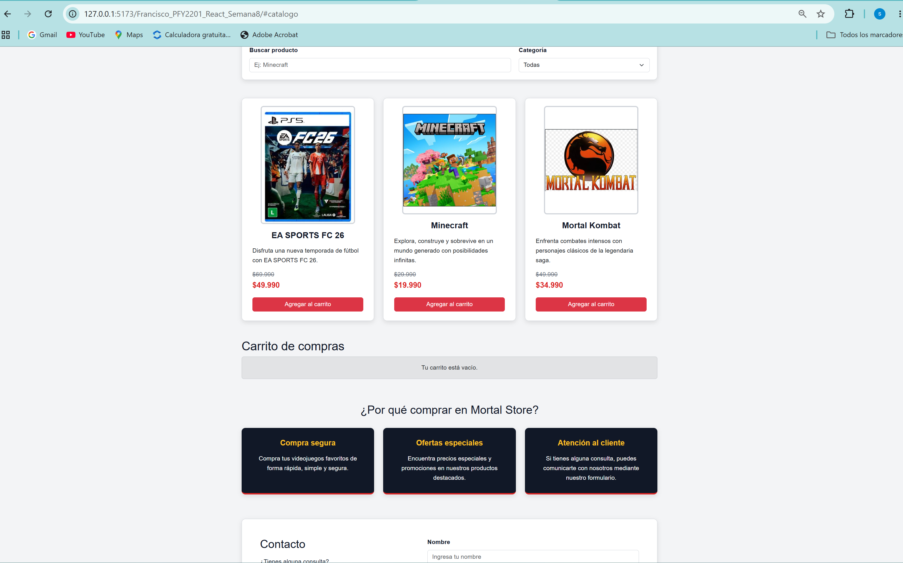
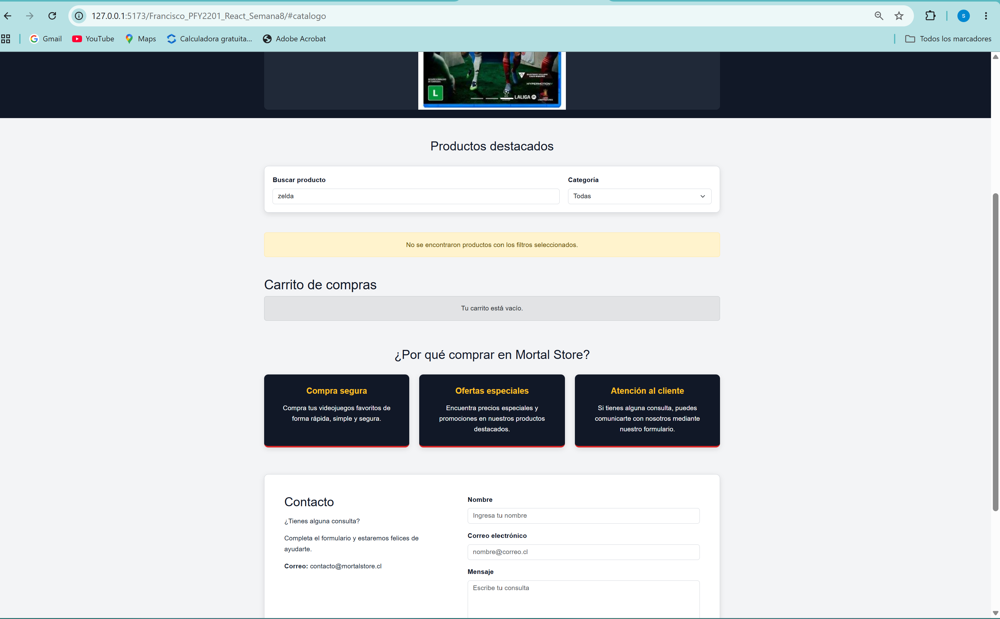
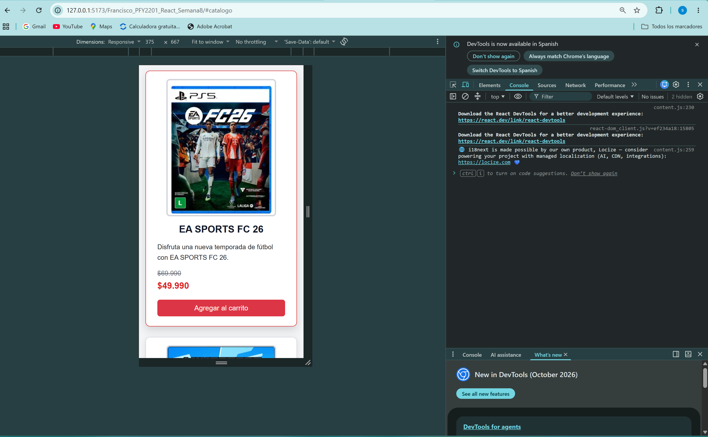

# Bimestre_08_DFI_Exp3_S8_FranciscoHenriquez

# 🎮 Mortal Store

Proyecto desarrollado progresivamente para la asignatura Desarrollo Frontend I (PFY2201).

Esta entrega corresponde a la evolución de Mortal Store durante la Semana 8, una tienda web de videojuegos desarrollada utilizando React, Vite, JavaScript, Bootstrap 5, CSS3 y JSON.

En esta versión se profundiza el uso de Hooks de React mediante `useState` y `useEffect`, incorporando carga dinámica de productos con `fetch`, actualización del estado de la aplicación, renderizado condicional y mejoras en la organización y reutilización del código.

---

## 🎯 Objetivo del proyecto

El objetivo de esta actividad es continuar el desarrollo de la aplicación eCommerce aplicando Hooks de React para administrar estados y efectos secundarios.

La aplicación permite cargar dinámicamente un catálogo de videojuegos, buscar y filtrar productos, agregarlos al carrito, modificar sus cantidades, eliminarlos y calcular automáticamente el total de la compra.

Además, se implementa renderizado condicional para modificar la interfaz según el estado de la aplicación, persistencia del carrito mediante Local Storage y estados de carga y error durante la obtención del catálogo.

---

## 🛠️ Tecnologías utilizadas

- HTML5
- CSS3
- JavaScript
- React
- Vite
- Bootstrap 5
- JSON
- Fetch API
- Local Storage
- Git
- GitHub
- GitHub Pages
- Visual Studio Code
- ESLint

---

## ⚙️ Funcionalidades implementadas

### 📦 Carga dinámica del catálogo

Los productos utilizados por la aplicación se encuentran almacenados en:

```text
public/data/productos.json
```

El catálogo se carga dinámicamente mediante `fetch` dentro de un `useEffect`.

Al recibir correctamente la información, los datos son utilizados para actualizar el estado del catálogo mediante `setProductos`.

Cada producto contiene información como:

- Nombre.
- Categoría.
- Precio normal.
- Precio de oferta.
- Descripción.
- Imagen.

De esta manera, los productos no se importan directamente desde JavaScript, sino que son obtenidos dinámicamente desde el archivo JSON.

### 🧩 Componentes funcionales

La aplicación está organizada mediante componentes funcionales reutilizables.

Entre los principales componentes se encuentran:

- `Header`
- `Navbar`
- `HeroCarousel`
- `ProductFilter`
- `ProductCard`
- `Cart`
- `InfoSection`
- `ContactForm`
- `Footer`

Esta organización permite separar las responsabilidades de la interfaz y mantener una estructura modular.

### 🔄 Props y estados

La aplicación utiliza propiedades (`props`) para compartir información y funciones entre componentes.

El Hook `useState` administra diferentes estados de la aplicación, entre ellos:

- Catálogo de productos.
- Productos seleccionados en el carrito.
- Cantidades de productos.
- Texto ingresado en el buscador.
- Categoría seleccionada.
- Estado de carga del catálogo.
- Estado de error durante la carga.
- Datos ingresados en el formulario.
- Estado del envío del formulario.

### ⚡ useEffect y carga de productos

Al iniciar la aplicación, `useEffect` ejecuta una función asíncrona encargada de solicitar el archivo JSON mediante `fetch`.

El flujo utilizado es:

```text
productos.json
      ↓
    fetch()
      ↓
  useEffect()
      ↓
setProductos()
      ↓
actualización del catálogo
```

Durante este proceso se administran estados de carga y error para informar adecuadamente al usuario.

### 💾 useEffect y persistencia del carrito

La aplicación utiliza además otro `useEffect` para guardar automáticamente el contenido del carrito en Local Storage cuando se producen cambios.

Gracias a esta funcionalidad, los productos y cantidades agregados permanecen disponibles después de actualizar o recargar la página.

### 🔎 Búsqueda de productos

La aplicación incorpora un campo de búsqueda que permite localizar videojuegos por su nombre.

El contenido mostrado se actualiza dinámicamente mediante `onChange` y el estado administrado por React.

### 🎮 Filtros por categoría

Los productos pueden filtrarse según su categoría.

Las categorías disponibles son:

- Todas.
- Deportes.
- Aventura.
- Lucha.

Los filtros pueden combinarse con la búsqueda por nombre.

### 🛒 Carrito de compras

El carrito permite:

- Agregar productos.
- Incrementar cantidades mediante el botón `+`.
- Disminuir cantidades mediante el botón `−`.
- Eliminar automáticamente un producto cuando su cantidad llega a cero.
- Eliminar completamente un producto mediante el botón `Eliminar`.
- Solicitar confirmación antes de eliminar completamente un producto.
- Visualizar la cantidad de cada producto.
- Calcular el subtotal correspondiente.
- Calcular la cantidad total de productos.
- Calcular automáticamente el precio total de la compra.
- Mantener el carrito después de recargar la página.

### 🔀 Renderizado condicional

La interfaz modifica los elementos mostrados según el estado de la aplicación.

Entre los casos implementados se encuentran:

- Mensaje mientras se cargan los productos.
- Mensaje cuando ocurre un error durante la carga.
- Mensaje cuando el carrito está vacío.
- Mensaje cuando una búsqueda o filtro no encuentra productos.
- Indicador `En el carrito` cuando un producto ya fue agregado.
- Visualización de la cantidad de unidades agregadas.
- Cambio del botón `Agregar al carrito` por `Agregar otra unidad`.
- Cambio del estilo del botón según el estado del producto.
- Mensaje de confirmación después de enviar el formulario de contacto.

### 🧮 Funciones reutilizables

Para evitar duplicación de código se incorporaron funciones auxiliares dentro de `src/utils`.

El archivo:

```text
src/utils/formatters.js
```

centraliza el formato monetario utilizado por la aplicación.

El archivo:

```text
src/utils/cartUtils.js
```

contiene funciones reutilizables para:

- Calcular la cantidad total de productos.
- Calcular el subtotal de un producto.
- Calcular el valor total del carrito.

### ⚡ Manejo de eventos

La aplicación utiliza diferentes eventos de React, entre ellos:

- `onClick`
- `onChange`
- `onSubmit`

Estos eventos permiten controlar el carrito, filtros, búsqueda y formulario de contacto.

### ✉️ Formulario de contacto

La aplicación mantiene un formulario controlado mediante React.

El formulario permite ingresar:

- Nombre.
- Correo electrónico.
- Mensaje.

Después de realizar el envío se muestra un mensaje de confirmación mediante renderizado condicional y los campos son limpiados automáticamente.

### 🎠 Carrusel de productos

La página incorpora un carrusel desarrollado con Bootstrap para mostrar videojuegos destacados.

El carrusel permite:

- Cambio automático de imágenes.
- Navegación mediante controles anterior y siguiente.
- Navegación mediante indicadores.

### 📱 Diseño responsive

La interfaz utiliza Bootstrap 5 y estilos CSS personalizados para adaptarse a diferentes tamaños de pantalla.

Se realizaron pruebas tanto en resolución de escritorio como en dispositivos móviles.

En resolución móvil, el catálogo reorganiza las tarjetas en una sola columna y adapta sus elementos al ancho disponible.

### ♿ Accesibilidad

Se incorporaron diferentes elementos orientados a mejorar la accesibilidad de la aplicación, entre ellos:

- Textos alternativos en imágenes.
- Etiquetas asociadas a campos de formulario.
- Atributos `aria-label`.
- Atributos `aria-labelledby`.
- Mensajes con `role="alert"`.
- Botones identificados según su función.

---

## 🆕 Mejoras implementadas en Semana 8

A partir del proyecto desarrollado durante la Semana 7, esta versión incorpora:

- Gestión del catálogo mediante `useState`.
- Carga dinámica del catálogo mediante `useEffect`.
- Obtención de productos con `fetch`.
- Archivo JSON local como fuente dinámica de datos.
- Estados de carga y error.
- Renderizado condicional según el estado de los productos.
- Cambio de texto y estilo de botones según el carrito.
- Eliminación completa de productos.
- Confirmación antes de eliminar un producto.
- Centralización del formato de precios.
- Separación de cálculos del carrito en funciones reutilizables.
- Mantención de la persistencia mediante Local Storage.

---

## 📁 Estructura del proyecto

```text
Francisco_PFY2201_React_Semana8/
│
├── public/
│   ├── capturas/
│   │   ├── 01-carga-dinamica.png
│   │   ├── 02-carrito.png
│   │   ├── 03-renderizado-condicional.png
│   │   ├── 04-carrito-vacio.png
│   │   ├── 05-sin-resultados.png
│   │   └── 06-responsive.png
│   │
│   ├── data/
│   │   └── productos.json
│   │
│   └── img/
│       └── [imágenes utilizadas por la aplicación]
│
├── src/
│   ├── assets/
│   │
│   ├── components/
│   │   ├── Cart.jsx
│   │   ├── ContactForm.jsx
│   │   ├── Footer.jsx
│   │   ├── Header.jsx
│   │   ├── HeroCarousel.jsx
│   │   ├── InfoSection.jsx
│   │   ├── Navbar.jsx
│   │   ├── ProductCard.jsx
│   │   └── ProductFilter.jsx
│   │
│   ├── utils/
│   │   ├── cartUtils.js
│   │   └── formatters.js
│   │
│   ├── App.css
│   ├── App.jsx
│   ├── index.css
│   └── main.jsx
│
├── .gitignore
├── eslint.config.js
├── index.html
├── package-lock.json
├── package.json
├── README.md
└── vite.config.js
```

---

## 🚀 Instalación y ejecución

Para ejecutar el proyecto localmente es necesario tener instalado Node.js.

### Clonar el repositorio

```bash
git clone https://github.com/FranciscoHenriquezAlvarez/Bimestre_08_DFI_Exp3_S8_FranciscoHenriquez.git
```

### Instalar dependencias

```bash
npm install
```

### Iniciar el servidor de desarrollo

```bash
npm run dev
```

Vite mostrará en la terminal la dirección local donde se encuentra disponible la aplicación.

### Verificar el código mediante ESLint

```bash
npm run lint
```

### Generar la compilación de producción

```bash
npm run build
```

La versión final de Semana 8 fue verificada correctamente mediante ESLint y compilada con Vite antes de su publicación.

---

## 🌐 Despliegue con GitHub Pages

El proyecto utiliza el paquete `gh-pages` para publicar la compilación de producción.

El despliegue se realiza mediante:

```bash
npm run deploy
```

Este comando genera la compilación y publica el contenido de la carpeta `dist` en la rama `gh-pages`.

**Sitio publicado:**  
https://franciscohenriquezalvarez.github.io/Bimestre_08_DFI_Exp3_S8_FranciscoHenriquez/

**Repositorio GitHub:**  
https://github.com/FranciscoHenriquezAlvarez/Bimestre_08_DFI_Exp3_S8_FranciscoHenriquez

---

## 🖼️ Evidencias de funcionamiento

### Carga dinámica del catálogo

Los productos son obtenidos dinámicamente desde el archivo JSON mediante `fetch` y posteriormente se muestran en el catálogo.



### Carrito de compras

El carrito permite agregar productos, modificar cantidades, eliminar productos y calcular automáticamente subtotales y totales.



### Renderizado condicional

Cuando un producto ya se encuentra agregado al carrito, la interfaz muestra su estado y cantidad y modifica el texto y estilo del botón.



### Carrito vacío

Cuando no existen productos agregados se muestra un mensaje informativo mediante renderizado condicional.



### Búsqueda sin resultados

Cuando ningún producto coincide con los criterios de búsqueda se muestra un mensaje de advertencia.



### Diseño responsive

La aplicación fue probada en un viewport móvil de 375 × 667 píxeles para comprobar la adaptación de la interfaz.



---

## ✅ Pruebas realizadas

Antes de finalizar la entrega se verificó:

- Carga dinámica del catálogo.
- Actualización del estado después de obtener los datos.
- Manejo de errores durante una carga fallida.
- Búsqueda de productos.
- Filtro por categoría.
- Agregar productos al carrito.
- Aumentar y disminuir cantidades.
- Eliminación automática al llegar a cero unidades.
- Eliminación completa mediante el botón `Eliminar`.
- Confirmación antes de eliminar.
- Cálculo de subtotales.
- Cálculo del total de productos.
- Cálculo del valor total del carrito.
- Actualización del contador del carrito.
- Renderizado condicional de productos agregados.
- Mensaje de carrito vacío.
- Mensaje de búsqueda sin resultados.
- Persistencia mediante Local Storage.
- Formulario de contacto.
- Diseño responsive.
- Revisión de la consola del navegador.
- Verificación mediante ESLint.
- Compilación de producción mediante Vite.

---

## 📚 Actividad académica

**Asignatura:** Desarrollo Frontend I (PFY2201)  
**Actividad:** Experiencia 3 - Semana 8  
**Proyecto:** Mortal Store  
**Estudiante:** Francisco Henríquez  

---

## 🔗 Enlaces del proyecto

**Repositorio:**  
https://github.com/FranciscoHenriquezAlvarez/Bimestre_08_DFI_Exp3_S8_FranciscoHenriquez

**Aplicación publicada:**  
https://franciscohenriquezalvarez.github.io/Bimestre_08_DFI_Exp3_S8_FranciscoHenriquez/

---

## 📌 Estado del proyecto

Proyecto finalizado, funcional, responsive y publicado mediante GitHub Pages.

La aplicación implementa componentes funcionales, props, eventos, `useState`, `useEffect`, carga dinámica mediante `fetch`, renderizado condicional, persistencia con Local Storage y funciones reutilizables para mantener una estructura clara y modular.
